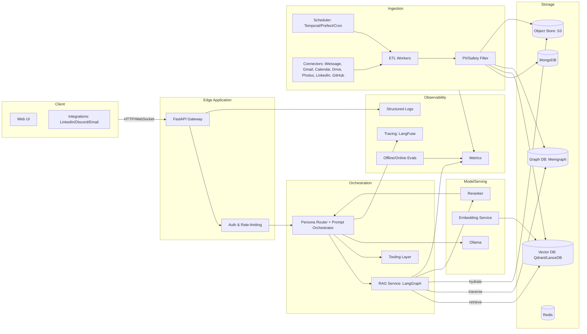
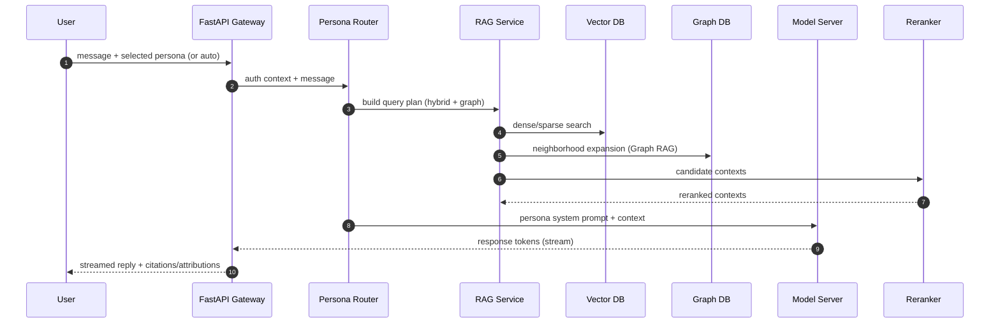

# me-ai: planning doc (v0.1) [10-21-2025]

> Goal: A self-hostable backend that exposes a chat interface representing "you" with multiple personas, automated private data ingestion, and Graph RAG retrieval. Optimized for reproducibility and portability.

---

## High-level architecture



---

## Data flow (request path)



---

## Personas

* **Persona Router**: lightweight policy that selects a system prompt and toolset per request. Inputs: message text, channel (LinkedIn, web chat), user profile, rate limits, safety policy.
* **Persona unit**: YAML-defined prompt + allowed tools + guardrails. Examples:

  * `recruiting`: career-focused, concise, links to portfolio.
  * `personal`: hobbies and stories, warmer tone.
  * `ops`: terse, command-like, for your own CLI.

> Store persona specs in repo under `personas/<name>.yaml`.

---

## Ingestion & Automated Retrieval

**Connectors** (opt-in via tokens/exports):

* Phone SMS/iMessage (via local backup parser), WhatsApp/Telegram exports
* Email (Gmail API), Calendar, Drive/Docs
* LinkedIn messages, GitHub issues/PRs, Photos/EXIF

**Pipeline**:

1. **Fetch** raw items → write to `OBJ` as immutable JSON/NDJSON.
2. **Normalize** to a common schema (events, messages, documents, media).
3. **PII/Safety filter**: redact contacts, emails, phone numbers unless whitelisted.
4. **Chunk & Embed** text; extract entities/relations for KG.
5. **Upsert**: `PG` (catalog + provenance), `VDB` (text chunks), `GDB` (entities/edges), `OBJ` (blobs).
6. **Schedule** via Temporal/Prefect every N hours/days with backfill detection.

**Schema highlights**:

* `items(id, source, type, created_at, blob_ref, hash)`
* `chunks(item_id, chunk_id, text, embedding, meta)`
* `entities(entity_id, type, name, attrs)`
* `relations(src, rel, dst, weight, ts)`

---

## Graph RAG Strategy (minimal viable)

1. LLM/NLP entity extraction → nodes: `Person`, `Project`, `Org`, `Topic`, `Event`.
2. Relation extraction → edges: `worked_on`, `knows`, `mentions`, `happened_at`, `authored`.
3. At query time:

   * run BM25 + dense search for seeds; map to nodes by provenance
   * expand k-hop neighborhood with edge-type and recency priors
   * gather evidence passages → rerank → compress (map-reduce)

---

## Model Serving (local-first)

* **Inference**: vLLM or TGI for HF models; Ollama for quick start.
* **Embeddings**: small local encoder (e.g., `gte-*`) with CPU fallback.
* **Reranker**: cross-encoder or lightweight late-interaction (e.g., `bge-reranker-*`).
* **Safety**: outbound response filter + persona allowlist.

> Provide simple switches to use hosted endpoints if desired.

---

## API Sketch (FastAPI)

* `POST /chat.stream` — WS or SSE; body: `{persona, message, session_id}`
* `POST /ingest/run` — trigger a named connector or workflow
* `GET /ingest/status` — recent runs & errors
* `GET /search` — debug retrieval: `{q}` returns passages + KG paths
* `GET /personas` — list available personas

Auth via **JWT** or **magic links**; per-channel API keys for integrations.

---

## Repo Layout

```
me-ai/
 ├─ me_ai/              # app source code
   |- api/              # FastAPI
   |- config/           # app configuration
 ├─ documentation       # planning/docs (defacto confluence/jira)
 ├─ personas/           # persona YAMLs
 ├─ rag/                # retriever, graph code, rankers, compressors
 ├─ ingestion/          # connectors, normalizers, PII filters
 ├─ storage/            # db clients, schemas, migrations (Alembic)
```

---

## Deployment

* **Local**: Docker Compose (MinIO + Postgres + Qdrant + Neo4j + vLLM + API)
* **Cloud**: Helm chart for k8s; set `STORAGE_CLASS`, `PVC` sizes, node affinity for GPU
* **Secrets**: `.env` + `doppler` or `sops` for CI/CD

---

## Privacy & Consent Guardrails

* Explicit allowlist of correspondents whose content can be surfaced to *others*
* Redaction policy for PII; configurable per persona
* Provenance/citation shown by default; clickable to opt-in reveal
* Easy **panic switch** to disable access to private sources per chat

---

## MVP Scope

* Compose stack, FastAPI gateway, one persona
* Local files + Gmail export ingestion
* Vector search + basic reranker
* vLLM/Ollama model + streaming chat
* Basic logs/metrics; CLI + simple web UI

---

## Stretch Goals

* Temporal orchestration; incremental sync for connectors
* Full Graph RAG + path attributions
* Fine-tuning or LoRA adapters per persona
* Evaluations: retrieval quality + response quality dashboards

---

## TODOs
- [ ] Finish out scoping out FastAPI app and writing tests
- [X] Dev Hygeine: Makefile and cleanup a bit
- [X] Create CI pipeline
- [ ] Start adding to README
---
